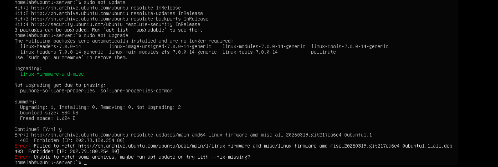

# APT 403 Forbidden Error

## Problem

While performing the initial system update after installing Ubuntu Server, `sudo apt upgrade` failed with a `403 Forbidden` error.

The error occurred while downloading `linux-firmware-amd-misc`.

## Symptoms

The following error was displayed:

```text
403 Forbidden
Failed to fetch http://ph.archive.ubuntu.com/ubuntu/...
Unable to fetch some archives
```
## Investigation

First, I verified that the server had working network connectivity:
```bash
ping -c 4 google.com
```

The ping was successful, indicating that the problem was not a general network connectivity issue.

Upon further research of the error through the internet, apparently, the package repositories were reachable, but the Philippine Ubuntu mirror was returning a `403 Forbidden` response for the required package.

## Cause

The configured Ubuntu package mirror was unable to provide the requested package.

The server was using:
`
http://ph.archive.ubuntu.com/ubuntu
Solution
`

Changed the Ubuntu package source from the Philippine mirror to the main Ubuntu archive:

```bash
sudo sed -i 's|http://ph.archive.ubuntu.com/ubuntu|http://archive.ubuntu.com/ubuntu|g' /etc/apt/sources.list.d/ubuntu.sources
```

Then refreshed the list and upgraded the package:
```bash
sudo apt update
sudo apt upgrade
```

## Verification

The package manager was able to access the repository and continue the upgrade without the previous 403 Forbidden error.

## Lessons Learned
- APT relies on package repositories and mirrors to download software.
- A server can have working internet connectivity while a specific package mirror is unavailable.
- HTTP status codes such as 403 Forbidden can help identify repository access problems.
- Changing to another official Ubuntu mirror can resolve mirror-specific problems.

## Screenshot

The original error was documented in the following screenshot:


